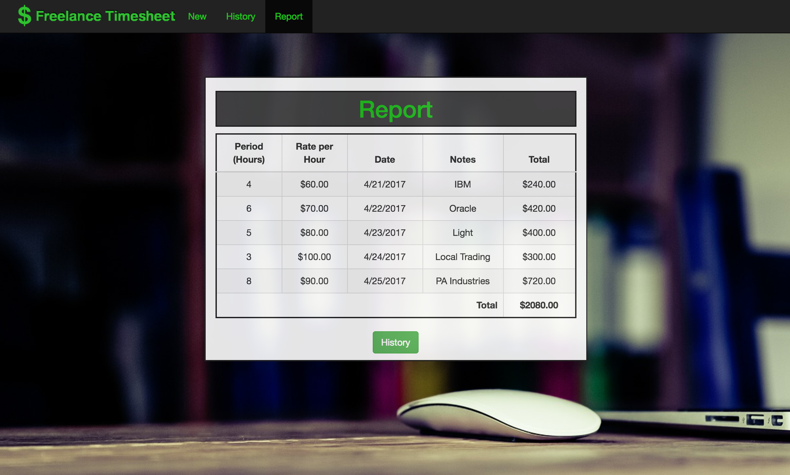

# Freelance Timesheet
A Spring REST web application that keeps track of freelance work over time and provides a report.

## In This Document:
1. [Application URL](#application-url)
2. [How to Use the Application](#how-touse-the-application)
3. [Technologies Used](#technologies-used)
5. [Future Feature Sets](#future-feature-sets)
6. [Stumbling and Learning Points](#stumbling-and-learning-points)

## Application URL
http://shaundashjian.com:8080/FreelanceTimesheet/

## How to Use the Application
* The landing page shows a form for the user to fill and add a new work item
* The navgation bar includes the following options: 
  * New 
  * History
  * Report
* The user can select the New option to bring up the form to add a new work item
* The user can select the History option to view a list of all work items in the system
  * Here, the user could view, edit, or delete each work item individually
* The user can select the Report option to view a report of all items and the total pay 

## Technologies Used
  * Spring REST web services
  * Java
  * HTML, CSS, JavaScript and jQuery
  * JPA and Hibernate
  * MySQL

## Future Feature Sets:
  * Enhance reporting to include:
    * Total pay between two dates
    * Total pay from a certian client
    * Average pay per week
  * Search for a certain work item
   
  
## Stumbling and Learning Points:
  * Better utilization of existing Bootstrap classes
  

[Up](README.md)
